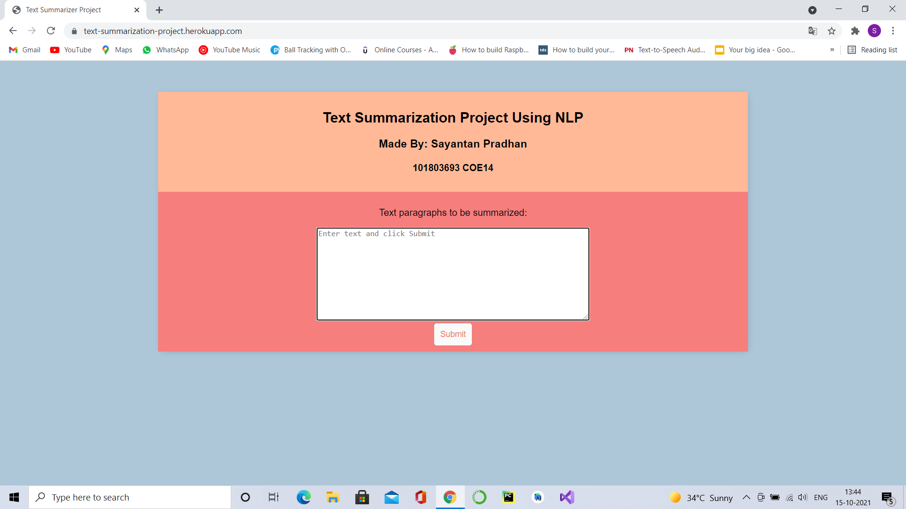
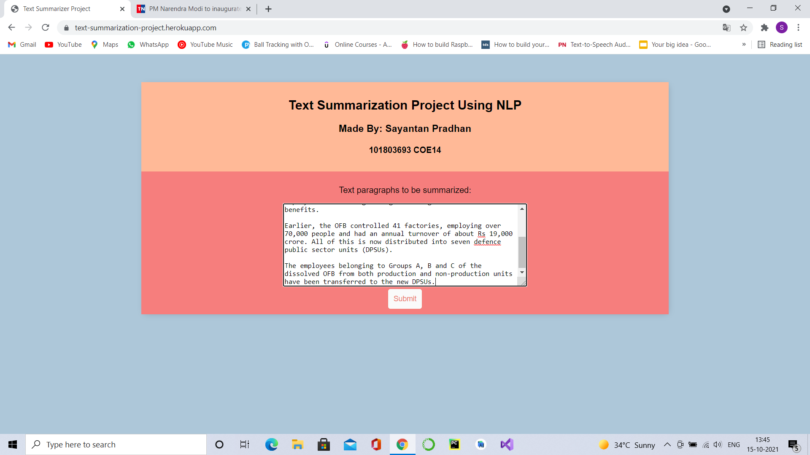
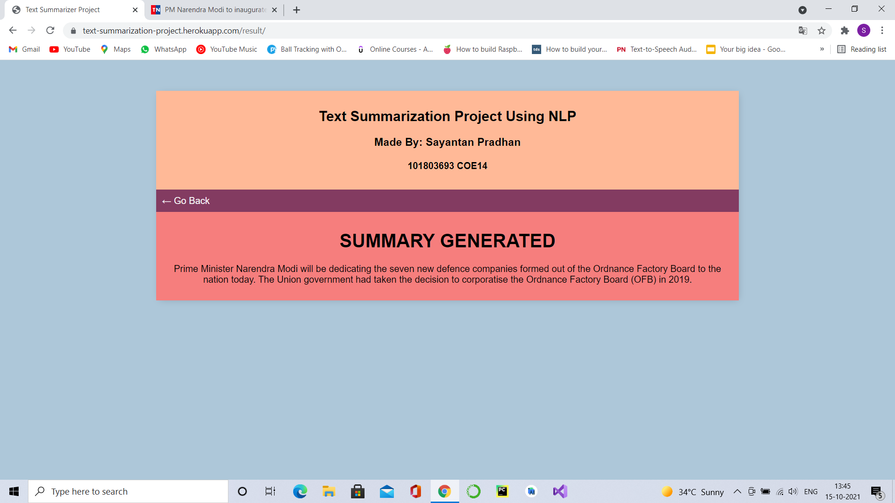

# Text Summarization Using NLP 
## Django project for text summarization using NLP
#### Visit the live website here:- https://text-summarization-project.herokuapp.com/ 

 The project is a text summarizer made using Django Rest-Framework and NLTK Library for natural language processsing. The website is made using html and css.

 The user has to enter the paragraph to be summarized in the website textfield and hit 'submit'. Then the user will be provided with the summary of the paragraph.

 The text summarization model is made using nltk library and is present in the summary directory with name 'text_summarizer.py'.

#### To show the working, the paragraph entered:

 India is on the track to complete 100 crore vaccinations in the next 3-4 days. While this is good news in terms of Covid management, the probable festive surge may add new worry. Since July this year, health experts and the Centre have been warning about the third wave of coronavirus infections. All along, it was a case of ‘when’. So, the big question is – will India see the third wave soon? We will know the answer in the next 15-20 days. Generally, there has always been a case of festive surge soon after any large public movement and the Navratris are no different. While a lot was said about Covid protocols, social media is flooded with updates from maskless people crowding temples and pooja pandals. With several breakthrough cases and a double vaccinated population still under 40 per cent, we are still not out of woods yet.

#### The summary generated:

India is on the track to complete 100 crore vaccinations in the next 3-4 days. With several breakthrough cases and a double vaccinated population still under 40 per cent, we are still not out of woods yet.

## Screenshots of working project

<table style="width:100%">
  <tr>
    <th></th>
    <th></th>
  </tr>
  <tr>
    <th></th>
  </tr>
  </table>
